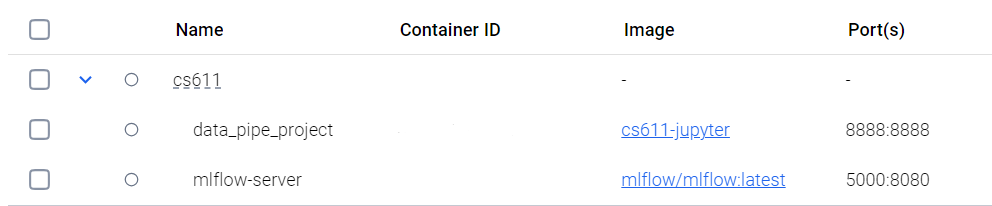

# End to End Machine Learning Pipeline
This project implements a fully automated end-to-end machine learning pipeline that ingests raw data, performs preprocessing and feature engineering, trains and evaluates multiple machine learning models, and generates predictions. 

This pipeline is for the module CS611.

## Table of Contents
- [About](#-about)
- [Usage](#-how-to-build)

## 🚀 About
There are two main pipelines in this project: data_pipeline and ml_pipeline. Apache Spark and MLflow are used for the data and ml pipelines. Docker is used to containerize the environment for each pipeline. 

The file structure is shown below:
```
│
├── data/                          # Store the raw CSV files here
├── datamart/                      # Jupyter notebooks for exploration and experimentation
│   ├── bronze/                    # Ingested data for the bronze layer 
│   ├── silver/                    # Cleaned data for the silver layer
│   └── gold/                      # Prepared data for the gold layer
│
├── etl/                           # Source code for the ETL pipeline
│   ├── conf.yaml                  # Configuration file for the ETL pipeline
│   ├── bronze_layer.py           # Scripts for raw data ingestion 
│   ├── silver_layer.py           # Scripts for data cleaning
│   └── gold_layer.py             # Scripts for final data processing and dataset creation
│
├── ml/                            # Source code for the ML pipeline
│   ├── optuna_config/            # Hyperparameter search configuration files
│   │   ├── logistic.yaml         # Optuna config for logistic regression
│   │   └── xgboost.yaml          # Optuna config for XGBoost
│   ├── data_loader.py            # Functions to load and prepare data for ML
│   ├── preprocessor.py           # Data preprocessing utilities (scaling, encoding, etc.)
│   └── model_manager.py          # Model training, evaluation, and persistence logic
│
├── run_data_pipeline.py          # main script to run the data pipeline
├── run_ml_pipeline.py            # main script to run the ml pipeline
├── Dockerfile                    # Instructions to build the Docker image
├── docker-compose.yml            # Define and run multi-container Docker applications
├── .gitignore                    # Specify intentionally untracked files to ignore
├── requirements.txt              # List of Python dependencies
└── README.md                     # Project documentation and setup instructions


```

## 📝 Usage


```
# Clone the repository, and install docker desktop

# In the project root, 
docker compose up

```

There are two containers: data_pipe_project, mlflow-server.



data_pipe_project is used as the main container to run the data and ml pipelines, mlflow-server provides the mlflow ui

## Running the ML Pipeline

```
in the project root, 
python run_ml_pipeline.py

```
The script will:
1. Load feature and label data
2. Perform time-based train-test-oot splits
3. Preprocess features for both logistic regression and XGBoost
4. Apply SMOTE or undersampling
5. Tune hyperparameters using Optuna
6. Evaluate models and log everything to MLflow

## MLflow Tracking
All experiment runs, models, parameters, and metrics are automatically logged to:
- mlruns/ folder (mounted volume)

Open MLflow UI at: http://localhost:5000

