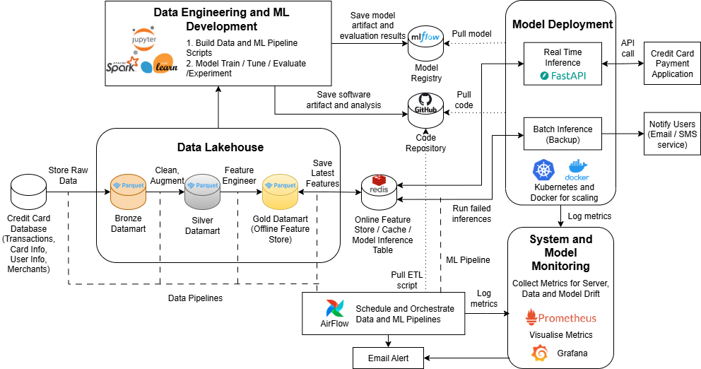

# End-to-End ML Pipeline for Fraud Detection System

This project implements a fully automated end-to-end machine learning pipeline that ingests raw data, performs data preprocessing and feature engineering, trains and evaluates multiple machine learning models, generates predictions and monitor model performance overtime.

The reference dataset is from kaggle: https://www.kaggle.com/datasets/computingvictor/transactions-fraud-datasets

## Table of Contents
- [Installation](#-how-to-build)
- [Pipeline Containers Overview](#-Containers)
- [Running the pipelines](#-running-pipelines)

## 📝 Installation 

Clone the project

```bash
  git clone https://github.com/Printf-Hello-World/CS611.git
```

Go to the project directory

```bash
  cd CS611
```

Checkout branch

```bash
  git checkout -b <branch name>
```

Docker Compose 

```bash
  docker-compose up --build
```

## 🚀 Pipeline Containers Overview

| Category                  | Containers                                  | Description                       |
|---------------------------|---------------------------------------------|---------------------------------|
| 🛠️ **Airflow Containers**    | Apache Airflow 3.02 containers| Core Airflow components for orchestration and API management |
| 📊 **MLflow Container**       | mlflow                                      | Experiment tracking and model registry |
| 💻 **Machine Learning**       | main (Jupyter Lab)                           | Model development and training environment |
| ⚡ **Inference & Monitoring** | FastAPI                                     | Serving inference APIs and monitoring endpoints |
| 🗄️ **Database Containers**    | redis, postgres                             | Caching and relational database storage |


## 🔥 Running the pipelines 
The pipelines in this project can be run separately within their docker containers, or they can be triggered using the airflow UI.

### 🛠️ Data processing pipeline 

The ETL pipelines are configured using the etl_conf.yaml file in the ETL folder.

Configure etl date range at etl_conf.yaml to specify the start_date and end_date 

```yaml
  start_date: "2018-01-01"
  end_date: "2019-01-31"
```

Run the following command in project root 

```bash
  python run_data_pipeline.py 
```

This script will:

1. Create bronze, silver and gold features and labels and store it in an offline feature store. 
2. Create an online feature store by pulling the data from the offline feature store.

### 🤖 Machine learning pipeline 
The ML pipeline is configured using the ml_conf.yaml file in the ml folder.

This pipeline runs 3 different machine learning models:
- Logistic Regression (using sklearn)
- XGBoost (using xgboost)
- Multi-Layer Perceptron(MLP) (using sklearn)

There are 2 main parts to configure for this pipeline. 

**Machine learning parameters** 

```yaml
dataloader_config:
  # choose the training range, the range is from the start to the present day
  start_date: "2019-08-01"

  # gold feature dir
  gold_feature_dir: datamart/gold/feature_store

  # gold label dir
  gold_label_dir: datamart/gold/label_store

preprocessor_config:
  # SMOTE toggler
  use_smote: True

  # how many oot splits from the most recent data
  oot_splits: 3

  # how many days per split, days because we are using daily data
  oot_period: 7

  # features to keep (NEED TO INCLUDE LABEL)
  columns_to_keep:
    - is_fraud
    - amount
    - use_chip
    - merchant_city
    - merchant_state
    - zip 
    - mcc
    - errors
    - has_chip
    - num_credit_cards
    - card_brand
    - card_type
    - num_cards_issued
    - credit_limit
    - year_pin_last_changed
    - acct_opened_months
    - yrs_since_pin_changed
    - per_capita_income
    - credit_score
    - yearly_income

model_config:
  # experiment name for mlflow
  experiment_name: "demo"

  run_name: "demo run"

  # name of model
  model_name: "xgboost" # mlp, xgboost, or logistic

  # number of trials for optuna
  n_trials: 20

  # model path if just loading model, not training
  model_path: ""
```

**Hyperparameter Search Space** 

```yaml
optuna_config:
  tunable_params:
    n_estimators:
      type: int
      low: 100
      high: 500

    max_depth:
      type: int
      low: 3
      high: 10

    learning_rate:
      type: float
      low: 0.01
      high: 0.3

    subsample:
      type: float
      low: 0.6
      high: 1.0

    colsample_bytree:
      type: float
      low: 0.6
      high: 1.0
```

Run the following command in project root after configuring the above. 

```bash
  python run_ml_pipeline.py 
```
### 📋 Script Overview

This script will:

1. **Load features and labels**  
2. **Perform time-based train-test-oot splits**  
3. **Preprocess features** for both logistic regression and XGBoost  
4. **Apply SMOTE or undersampling** depending on configuration  
5. **Tune hyperparameters** using Optuna  
6. **Evaluate models** and log all results to MLflow  

---

### Registering Models in MLflow

To register your models, follow these steps on the MLflow UI (usually at `localhost:5000`):

1. Navigate to the **Models** tab  
2. Click **Register Model**  
3. Select **Create New Model**  
4. Enter the model name: `"demo"`  
5. Go to the **Model** tab  
6. Click on the model you just registered (e.g., `"demo"`)  
7. Add an alias `"best"` and save  


### 🚀 Model Inference Pipeline 

Important: Before making any inference, run the following command in project root. This script will use ```card_number``` in the inference json to query the Redis database and retrieve the required input features for inference. 

```bash
python run_online_feature_data_pipeline.py 
```

Next, spin up the ```ml_inference_monitoring_container```.  This will pull the best model from the MLflow registry to be used for inference. Then execute the following steps to get inference results:

1. Go to FastAPI (localhost:8000/docs#)
2. Click "Get" , "Try it out", "Execute" to check if model is ready for prediction. If ready, "Model is ready for predictions" will show up. 
3. Click "Post", "Try it out". Enter inference data in json format. Then "Execute"

Inference results will be stored at `monitoring/inference_data/`

### 📊 Model Monitoring Pipeline 
Run the following command in project root. This script will monitoring label and data drift. 

```bash
  python monitoring_pipeline.py 
```

1. Go to EvidentlyAI (localhost:9000)
2. Click on Reports tab to access monitoring reports


## 👥 Collaborators

- [@Siying](https://github.com/yeosiying)
- [@Alvin](https://github.com/alzx1990)
- [@Dolly](https://github.com/bitofbean)
- [@Logan](https://github.com/th-chew)
